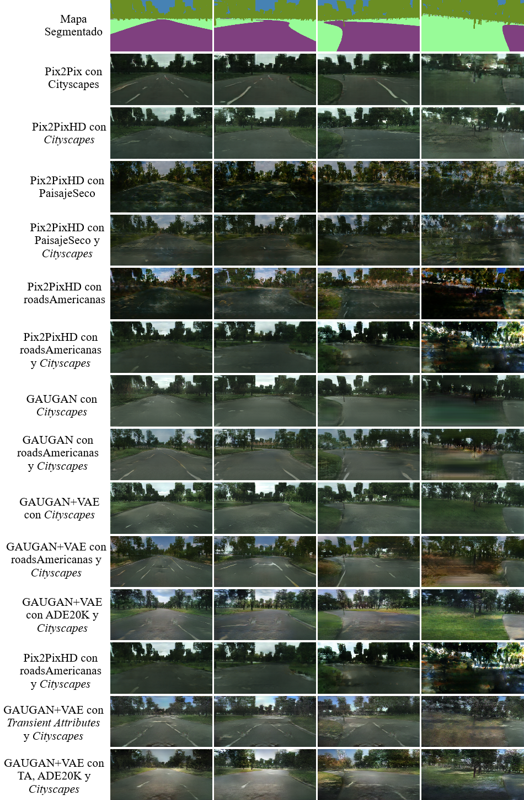
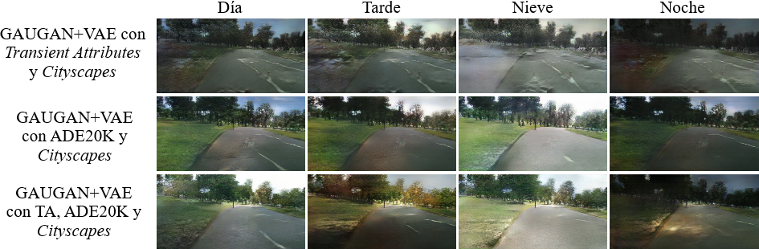

# Conducción autónoma con el uso de imágenes sintetizadas con Redes Generativas Adversarias

**Link de la memoria del trabajo:** https://e-archivo.uc3m.es/ (Actualizado cuando esté disponible)

## Resumen del trabajo 

La conducción autónoma es un tema latente actualmente y cualquier tipo de mejora y nuevo acercamiento que se pueda ofrecer puede llegar a ser determinante. En este trabajo de fin de carrera se muestra un nuevo enfoque que consiste en la utilización de **Redes Generativas Adversarias** para generar imágenes de **carreteras realistas** que puedan ser utilizadas como apoyo para conjuntos de imágenes de Conducción Autónoma. Esto puede **acortar los tiempos de obtención de conjuntos de imágenes etiquetadas**, permitiendo que conjuntos de imágenes previamente muy escasos, comiencen a tener una buena cantidad de imágenes y variabilidad.

Para poder llevar a cabo este proyecto, ha sido necesario utilizar como base el simulador que el usuario de GitHub **tawnkramer** ofrece en su repositorio (https://github.com/tawnkramer/sdsandbox). Se han hecho múltiples modificaciones a este simulador entre las que destacan la **generación de circuitos aleatorios con mapas de Kohonen** y la implementación de una **infraestructura cliente-servidor que permite transmitir imágenes de gran tamaño**.

Por último, el trabajo de fin de carrera termina con la **implementación de un sistema de conducción autónoma** capaz de conducir en algunos circuitos aleatorios utilizando las imágenes generadas por la GAN.

## Modelos de síntesis de carreteras realistas 

Los modelos que se muestran en la siguiente tabla han sido entrenados con distintos conjuntos de imágenes que se explican en la memoria del trabajo de fin de grado. Algunos de ellos son ampliamente conocidos, como *Cityscapes* o ADE20K, pero igualmente se van a puntualizar algunos datos.

- ***Cityscapes***: <a href="https://www.cityscapes-dataset.com/">Cityscapes</a> es un conjunto de imágenes que contiene tanto la propia imagen realista como su par segmentado. Todas las imágenes son de carreteras alemanas desde el frontal del coche.
- **PaisajeSeco**: Este conjunto de imágenes ha sido obtenido a mano mediante la obtención de *frames* de distintas secciones del siguiente <a href="https://youtu.be/ZOZOqbK86t0">vídeo</a>.
- **roadsAmericanas**: Este conjunto de imágenes ha sido generado mediante la obtención de un *frame* cada 30 frames del mismo <a href="https://youtu.be/ZOZOqbK86t0">vídeo</a> mencionado en el conjunto de PaisajeSeco.
- **ADE20K**: Este conjunto de datos tiene muchísimas imágenes. Para acotarlo y solo utilizar imágenes relacionadas con paisajes, se utiliza un subconjunto utilizado por un trabajo llamado <a href="https://hucvl.github.io/attribute_hallucination/">Attribute Hallucination</a>.
- ***Transient Attributes***: Este conjunto de datos es un conjunto de imágenes de distintas *webcam* repartidas en distintos lugares del mundo a lo largo de las estaciones. Gracias a esto, se puede obtener un mismo mapa segmentado pero con distintos estilos. El trabajo del que se ha obtenido este conjunto de imágenes se llama <a href="http://transattr.cs.brown.edu/files/TransientAttributes-paper.pdf">Transient Attributes</a>.

### Modelos unimodales

| Modelos creados en la experimentación | Descarga |
| --- | --- |
| **Arquitectura**: Pix2Pix   ***Data sets***: *Cityscapes* (3.475 imágenes) | <a href="https://mega.nz/file/CdVRVYoC#HxjnL8TPJhWlhAGoL1qOtfXTs9wU8fdZi9yB_YJVePk"> Download </a> |
| **Arquitectura**: Pix2PixHD   ***Data sets***: *Cityscapes* (3.475 imágenes) | <a href="https://mega.nz/file/uEEFlKxa#aWWAnu70ll_FXRg_CsifXEVolP2cMlek1AylzFpV7VY"> Download </a> |
| **Arquitectura**: Pix2PixHD   ***Data sets***: PaisajeSeco (1.728 imágenes) | <a href="https://mega.nz/file/GQdTkSqZ#j91njGjlfLxUs11Qb_VcLrYNTO0dNNAq0YLtfuZpvLw"> Download </a> |
| **Arquitectura**: Pix2PixHD   ***Data sets***: *Cityscapes* (3.475)   &nbsp; &nbsp; &nbsp;&nbsp;&nbsp;&nbsp;&nbsp;&nbsp;&nbsp;&nbsp;&nbsp;&nbsp;&nbsp;&nbsp; PaisajeSeco (1.728 imágenes) | <a href="https://mega.nz/file/OREVnIQT#wlYCiex554__BI19NkA2gGuondX239kFwi7DM4sV8GA"> Download </a> |
| **Arquitectura**: Pix2PixHD   ***Data sets***: roadsAmericanas (1.992 imágenes) | <a href="https://mega.nz/file/XQ1V2JxQ#2ue1hnlZtuskKLaYsv_2b_3a9ENNwNQwKFgiHiM-ldk"> Download </a> |
| **Arquitectura**: Pix2PixHD   ***Data sets***: *Cityscapes* (3.475)   &nbsp; &nbsp; &nbsp;&nbsp;&nbsp;&nbsp;&nbsp;&nbsp;&nbsp;&nbsp;&nbsp;&nbsp;&nbsp;&nbsp; roadsAmericanas (1.992 imágenes) | <a href="https://mega.nz/file/aBlR3DhA#Bo0NBBwLnZd9g_QcA64ZNxPEA3CwBDVuKfuqXeMUVkU"> Download </a> |
| **Arquitectura**: GAUGAN sin VAE   ***Data sets***: *Cityscapes* (3.475 imágenes) | <a href="https://mega.nz/file/CIEEgYZD#y_8GM_QzXlDtspIcdWZw9yhEuk7F3f-iijrglGRcQjo"> Download </a> |
| **Arquitectura**: GAUGAN sin VAE   ***Data sets***: *Cityscapes* (3.475)   &nbsp; &nbsp; &nbsp;&nbsp;&nbsp;&nbsp;&nbsp;&nbsp;&nbsp;&nbsp;&nbsp;&nbsp;&nbsp;&nbsp; roadsAmericanas (1.992 imágenes) | <a href="https://mega.nz/file/GI8QXCZL#1gT9dBoPibLlrOTCcP_0s91Y5WJ9-FfU8GTfPoAXa70"> Download </a> |
| **Arquitectura**: GAUGAN con VAE   ***Data sets***: *Cityscapes* (3.475) | <a href="https://mega.nz/file/DU9QHayQ#Y9aUGqYCz-2lQwxxJu5aWt1tL9YR3N8HW_MIOfRTkso"> Download </a> |
| **Arquitectura**: GAUGAN con VAE   ***Data sets***: *Cityscapes* (3.475)   &nbsp; &nbsp; &nbsp;&nbsp;&nbsp;&nbsp;&nbsp;&nbsp;&nbsp;&nbsp;&nbsp;&nbsp;&nbsp;&nbsp; roadsAmericanas (1.992 imágenes) | <a href="https://mega.nz/file/2Q8SQKzA#Hy6C5xqd3RJnIyUTdwlDfM5doT4qdrJ-r4LvlI0Hpf8"> Download </a> |

### Modelos multimodales

| Modelos creados en la experimentación | Descarga |
| --- | --- |
| **Arquitectura**: GAUGAN con VAE   ***Data sets***: *Cityscapes* (3.475)   &nbsp;&nbsp;&nbsp;&nbsp;&nbsp;&nbsp;&nbsp;&nbsp;&nbsp;&nbsp;&nbsp;&nbsp;&nbsp;&nbsp;&nbsp;&nbsp; ADE20K (8.363 imágenes) | <a href="https://mega.nz/file/jcESBKqC#qu0qcDS6QliSR7C5TfgLgb2QFM2QbBzh97UiY_FaOmY"> Download </a> |
| **Arquitectura**: GAUGAN con VAE   ***Data sets***: *Cityscapes* (3.475)   &nbsp;&nbsp;&nbsp;&nbsp;&nbsp;&nbsp;&nbsp;&nbsp;&nbsp;&nbsp;&nbsp;&nbsp;&nbsp;&nbsp;&nbsp;&nbsp; *Transient Attributes* (8.571 imágenes) | <a href="https://mega.nz/file/fIUGHArD#xi5CC5UO4IEutZ1R8tz7IQxGMrJiu5ypJjBu9vKwgQQ"> Download </a> |
| **Arquitectura**: GAUGAN con VAE   ***Data sets***: *Cityscapes* (3.475)   &nbsp;&nbsp;&nbsp;&nbsp;&nbsp;&nbsp;&nbsp;&nbsp;&nbsp;&nbsp;&nbsp;&nbsp;&nbsp;&nbsp;&nbsp;&nbsp; ADE20K (8.363 imágenes)   &nbsp;&nbsp;&nbsp;&nbsp;&nbsp;&nbsp;&nbsp;&nbsp;&nbsp;&nbsp;&nbsp;&nbsp;&nbsp;&nbsp;&nbsp;&nbsp; *Transient Attributes* (8.571 imágenes) | <a href="https://mega.nz/file/GRdUGAbD#Qh8i7wSXwf4WYNbtETqkdydTvGtrfaUeKAFkCGdnVVk"> Download </a> |

## Tutorial de uso de los modelos de síntesis de carreteras realistas 

Para poder ejecutar los modelos, se recomienda utilizar uno de los programas que se utilizó durante el desarrollo de la solución. Los únicos requisitos necesarios para ejecutar los modelos son los mismos que aparecen en el repositorio de la respectiva arquitectura. Es decir, si se intenta utilizar un modelo de Pix2PixHD, será necesario tener todos los requisitos de su repositorio. En concreto, los repositorios que se utilizaron fueron: <a href="https://github.com/NVIDIA/pix2pixHD">Pix2PixHD</a> y <a href="https://github.com/NVlabs/SPADE">GAUGAN</a>.

Los ficheros para hacer la inferencia son los siguientes:

<a href="https://mega.nz/file/uV0RAAZC#cHyc2v9W2vwBRk-5GR8I2WZCIRHFMAdiXFBQojcm8AE">Fichero de inferencia con Pix2PixHD</a>

<a href="https://mega.nz/file/zY9TjCwa#6mcOjw6CY43DJtEifGq87QHHP8K8HrGGpv1FhCZiXfE">Fichero de inferencia con GAUGAN sin VAE</a>

<a href="https://mega.nz/file/Lc0DlKqC#rMNP6tKF7ks8Gnq-UQAF0JM9gqqvkDMzYu88jJB5d88">Fichero de inferencia con GAUGAN con VAE</a>

Para seleccionar qué modelo utilizar y en qué directorio inferir, se deben cambiar las opciones que aparecen al inicio de cada fichero entre los comentarios **"PROGRAM OPTIONS"**.

## Resultados obtenidos por los modelos unimodales

## Resultados obtenidos por los modelos multimodales

## Autor
David González González <a href="https://www.linkedin.com/in/david-gonzalez-gonzalez/">LinkedIn</a>

## Tutor
Juan Manuel Alonso Weber <a href="https://www.inf.uc3m.es/component/comprofiler/userprofile/jmaw">Perfil de la universidad</a>
