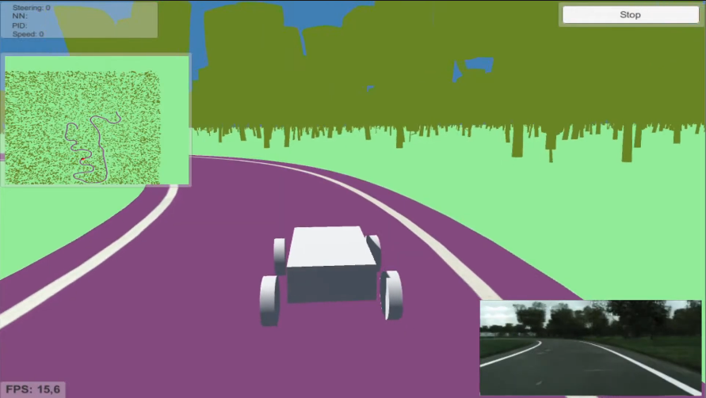
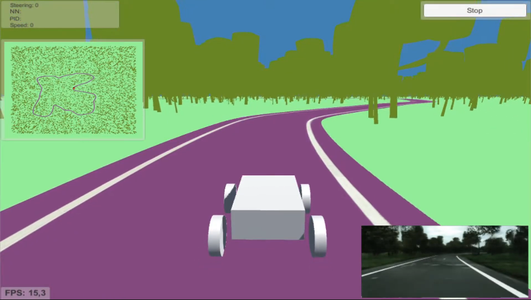

# Vídeos de conducción autónoma
En este trabajo la conducción autónoma se lleva a cabo a partir de las imágenes generadas por distintas redes generativas adversarias. El proceso consiste en generar la imagen con la GAN, reducir su dimensionalidad mediante el uso de un autoencoder y, finalmente, utilizar el vector latente producido por el autoencoder para inferir con una red densamente conectada el ángulo de giro de las ruedas. A continuación se muestran varios ejemplos de conducción autónoma en el simulador. En la esquina inferior derecha se pueden ver las imágenes que realmente está utilizando el vehículo para conducir.

Cabe destacar que las imágenes que aparecen en la esquina inferior derecha tienen poca calidad debido a que han sido reescaladas y transformadas en formato JPG para que la inferencia en tiempo real fuera lo más fluida posible.
## Conducción autónoma en un circuito procedural utilizando imágenes de Pix2PixHD entrenado con *Cityscapes*

**Enlace del vídeo:** https://youtu.be/dDUPPdEUMVE

## Conducción autónoma en un circuito generado con mapas de Kohonen utilizando imágenes de Pix2PixHD entrenado con *Cityscapes*

**Enlace del vídeo:** https://youtu.be/lx7hexBuBC0

## Conducción autónoma en un circuito procedural utilizando imágenes de GAUGAN entrenado con *Cityscapes*

**Enlace del vídeo:** https://youtu.be/H4Sfzau_bH4
