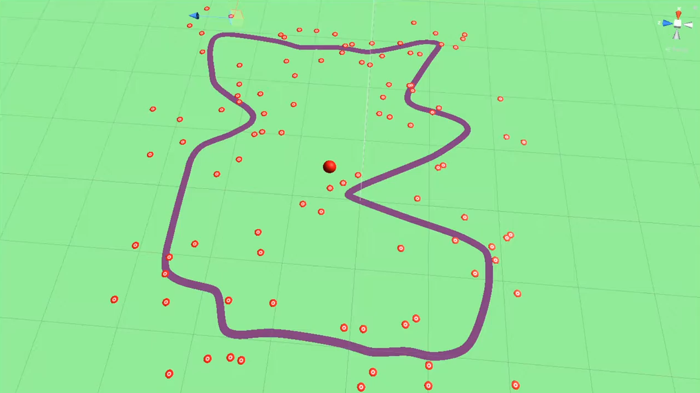

# Creación de circuitos aleatorios con mapas de Kohonen

Una de las mejoras introducidas en el simulador que se utiliza como base (https://github.com/tawnkramer/sdsandbox) es la creación de circuitos aleatorios con mapas de Kohonen, un tipo de red de neuronas no supervisada capaz de distribuir un conjunto de neuronas dependiendo de algunos parámetros. En el siguiente vídeo se pueden ver algunos ejemplos de circuitos y una demostración de cómo el coche puede conducir en los circuitos generados.

**Enlace del vídeo:** https://youtu.be/kN6BwJyBzhQ

Como se puede ver en el vídeo, dependiendo de la disposición de los distintos patrones de entrenamiento (puntos blancos y rojos) el anillo elástico se distribuye de una forma u otra, generando un circuito aleatorio.
