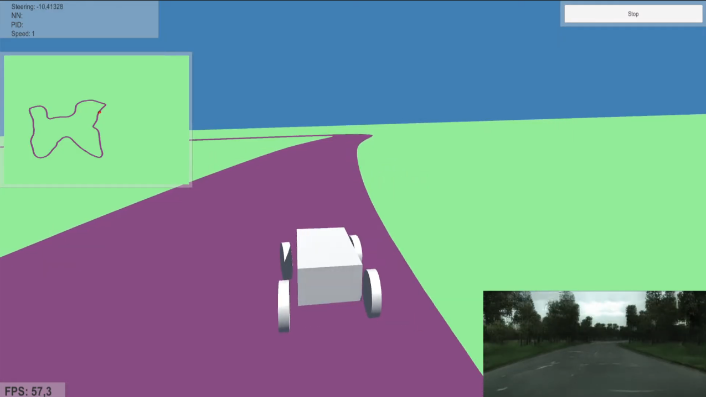
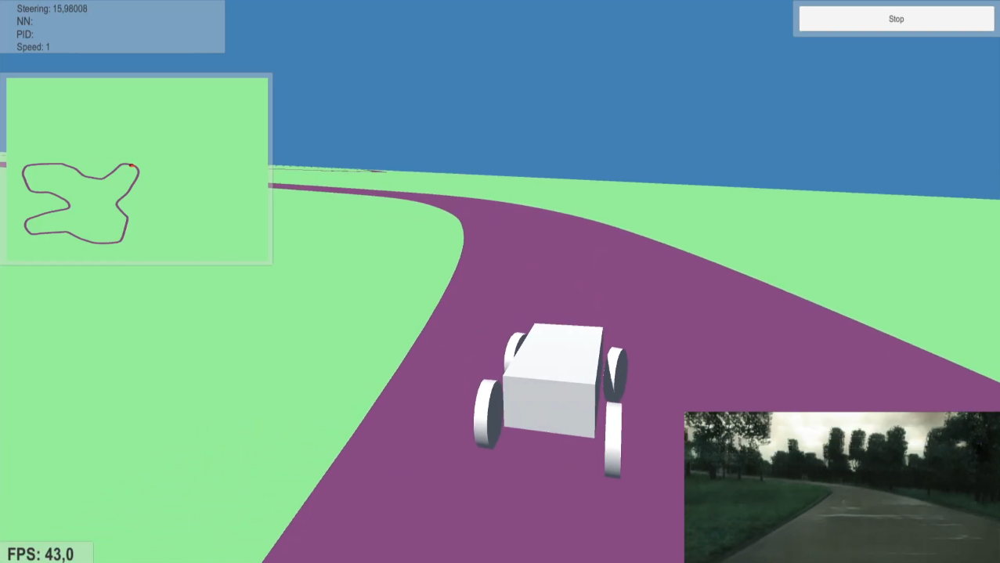
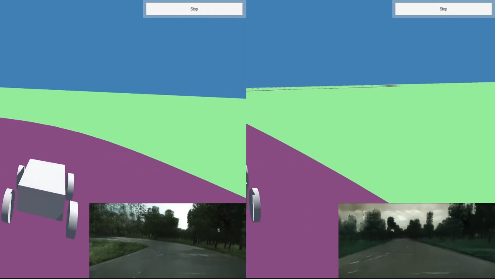

# Creación de la infraestructura cliente-servidor

Uno de los problemas que se tuvieron a lo largo del desarrollo de la solución es que para hacer la inferencia en las GAN era necesario utilizar Python, mientras que el simulador está implementado en C#, lenguaje de programación utilizado por Unity. Para solucionar el problema de hacer la inferencia en tiempo real y mostrar las imágenes mientras se conduce, se optó por hacer un servidor en Python que se encargara de las inferencias. Este servidor sería utilizado por Unity, el cual actuaría como cliente.

Se hicieron varias versiones de esta infraestructura hasta conseguir una que permitía obtener las imágenes de manera fluida

## Primera versión de la infraestructura cliente-servidor

**Enlace del vídeo:** https://youtu.be/LGSpM6oxXFw

## Versión final de la infraestructura cliente-servidor

**Enlace del vídeo:** https://youtu.be/9qm00Rm1gy0

## Comparación entre las dos versiones anteriores

**Enlace del vídeo:** https://youtu.be/uWq46nQ-_xQ
