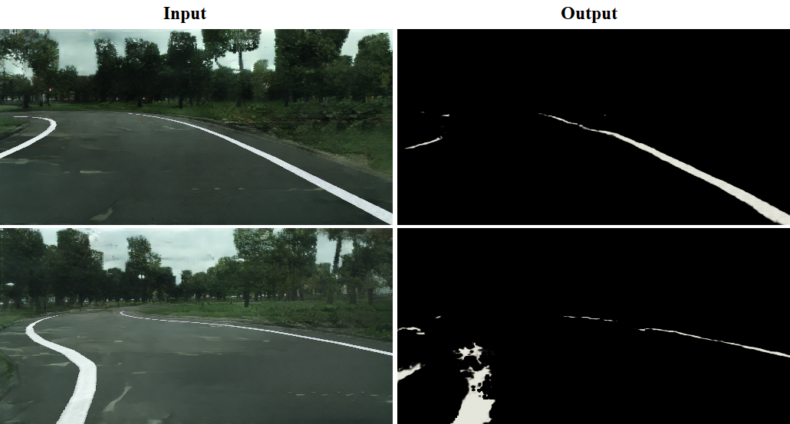
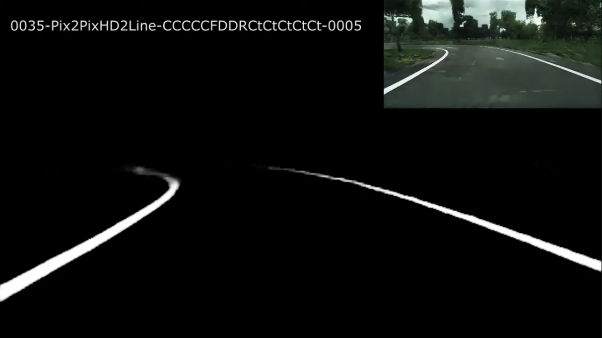
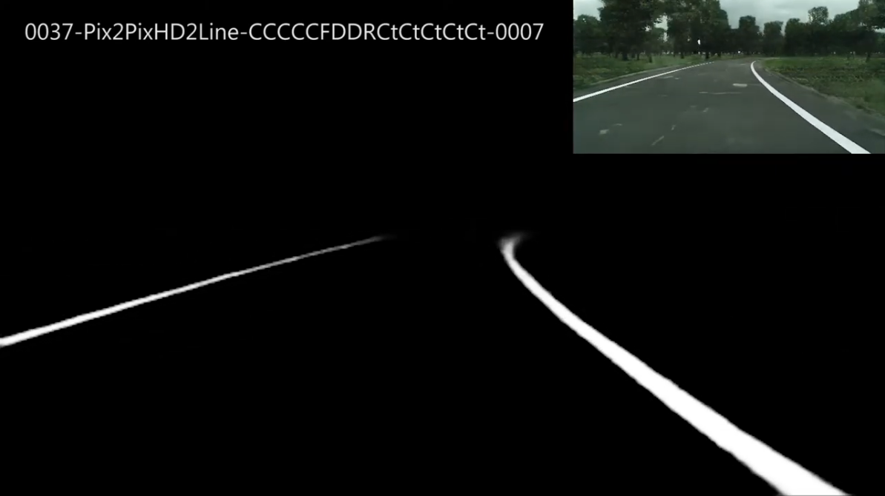
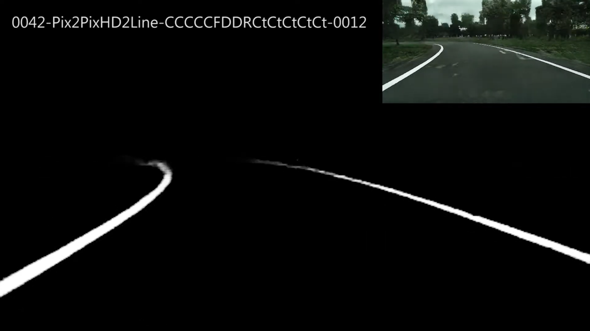

# Segmentación de las líneas de la carretera

El enfoque que se ha utilizado para hacer la conducción autónoma consiste en segmentar las líneas de la carretera con un autoencoder para posteriormente utilizar el vector de cada imagen para inferir el giro de las ruedas. Para llevar a cabo la segmentación de las líneas se hicieron varios experimentos. Los que se muestran a continuación son algunos de los que mejores resultados dieron. El número de imágenes utilizadas para entrenar aumenta en cada experimento.

Cabe destacar que antes de obtener los resultados de los siguientes vídeos, se hicieron modelos que no eran capaces de segmentar las líneas correctamente. En la siguiente imagen se puede ver un resultado con uno de los experimentos iniciales.

Una vez se comenzó a utilizar **data augmentation** con giros, simetrías y rotaciones, se obtuvieron las imágenes de los siguientes vídeos.

## Experimento 5. 

**Enlace del vídeo:** https://youtu.be/Pma1XzD4M7g

## Experimento 7.

**Enlace del vídeo:** https://youtu.be/EhUYSYTvWiU

## Experimento final.

Este es el modelo que se acabó utilizando para hacer la conducción autónoma.

**Enlace del vídeo:** https://youtu.be/FUcHWEHgNqg
